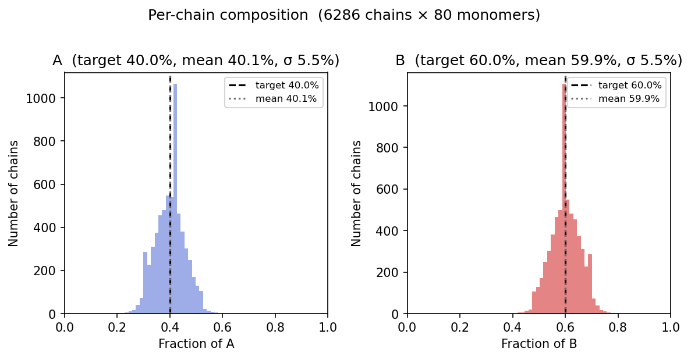
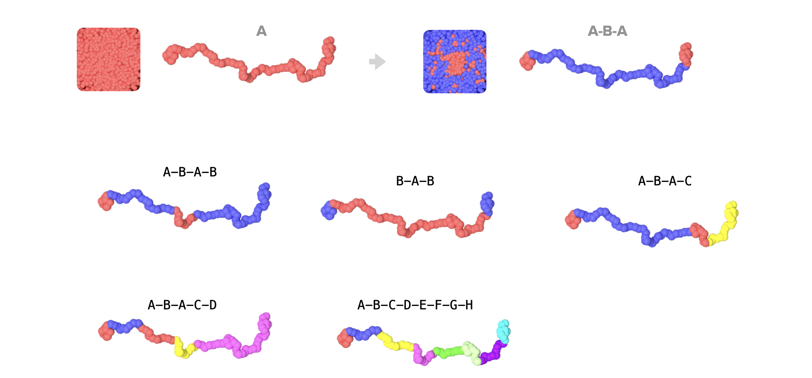
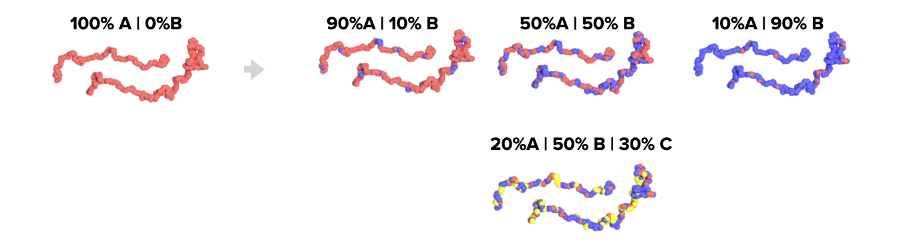

# repaint

A CLI tool for repainting copolymer atom types in LAMMPS datafiles.

Given an existing LAMMPS molecular datafile, `repaint` reassigns atom types in each chain to follow a new block copolymer pattern — preserving all coordinates, periodic image flags, velocities, and header metadata.

## Use case

Useful when you have a simulation structure (e.g. an equilibrated diblock) and want to reuse its geometry with a different monomer sequence, such as converting a diblock into a triblock or tetrablock, without re-running a full equilibration.

## Installation

```bash
pip install -e .
```

Requires Python >= 3.10.

## Usage

```bash
repaint --file <datafile> [--mode block|random] [mode-specific arguments]
```

**Shared arguments:**

| Argument | Description | Example |
|---|---|---|
| `--file` | Path to the input LAMMPS datafile | `sorted_tetrablock_data` |
| `--mode` | Repainting mode: `block` (default) or `random` | `random` |
| `--output` | Output file path (default: auto-generated under `results/`) | `my_output` |

**Block mode arguments** (`--mode block`):

| Argument | Description | Example |
|---|---|---|
| `--pattern` | Block types separated by `-` | `A-B-A` |
| `--lengths` | Block lengths separated by `-`, must sum to chain length | `10-60-10` |

**Random mode arguments** (`--mode random`):

| Argument | Description | Example |
|---|---|---|
| `--composition` | Target fraction for each type, separated by `-` | `A:0.4-B:0.6` |
| `--seed` | Random seed for reproducibility (required) | `42` |

**Examples:**

```bash
# Block mode (default): convert to A-B-A triblock
repaint --file sorted_tetrablock_data --pattern A-B-A --lengths 10-60-10

# Random mode: statistical copolymer with 40% A and 60% B
repaint --file sorted_tetrablock_data --mode random --composition A:0.4-B:0.6 --seed 42
```

Before writing any output, the tool displays a preview of the current and requested patterns and prompts for confirmation.

### Random mode output example

Running random mode on the provided `sorted_tetrablock_data` (6286 chains × 80 monomers, target 40% A / 60% B) produces this per-chain composition histogram saved alongside the output datafile:



The bell curve confirms the ensemble statistics are correct (mean ≈ target) and shows the expected chain-to-chain spread (σ ≈ 5.5%) from the binomial distribution over 80-monomer chains.

## OVITO Visualizations

The following visualizations were rendered in [OVITO](https://www.ovito.org/) from repainted LAMMPS datafiles. Each color represents a different monomer type.

**Block mode** — homopolymer to arbitrarily complex block copolymers:


**Random mode** — statistical copolymers with tunable composition:


## How it works

1. Reads the LAMMPS datafile and identifies chains by `mol_id`
2. Detects the existing block pattern from the first chain using run-length encoding
3. Shows a colored preview comparing the current and requested patterns and prompts for confirmation
4. On confirmation, assigns new atom types and writes a new datafile with the updated `Atoms` section; all other sections are copied verbatim

Coordinates and periodic image flags are unchanged.

**Block mode:** every chain gets the same sequence. Letters are mapped to integers alphabetically (A→1, B→2, C→3, …).

**Random mode:** each chain is independently sampled from the target composition using the given seed. This means individual chains will vary around the target fraction — the ensemble statistics are correct but no two chains are identical, which matches the chain-to-chain heterogeneity of real statistical copolymers. The `--seed` flag is required so results are always reproducible.

## Validation

`repaint` checks for the following before making any changes:

**Block mode:**
- Input file exists
- Number of blocks in `--pattern` and `--lengths` match
- Sum of `--lengths` equals the actual chain length

**Random mode:**
- Input file exists
- Composition fractions are valid floats greater than 0
- Composition fractions sum to 1.0
- No duplicate labels

**Both modes:**
- If the requested types exceed the number of atom types in the original file, a warning is displayed — the Masses and Pair Coeffs sections in the output file will need to be updated manually before running LAMMPS

## Input file format

The tool expects a standard LAMMPS molecular datafile with an `Atoms  # molecular` section:

```
atom_id  mol_id  atom_type  x  y  z  ix  iy  iz
```

A `Velocities` section is supported and preserved in the output.

## Project structure

```
repaint/
├── repaint/
│   ├── cli.py        # Argument parsing and entry point
│   ├── reader.py     # File reading and pattern detection
│   ├── painter.py    # Repainting logic and file writing
│   └── display.py    # Colored confirmation UI
├── tests/
├── examples/
│   ├── repaint.ipynb                    # Notebook with manual workflow
│   ├── sorted_tetrablock_data           # Example 80-monomer tetrablock datafile
│   ├── tetrablock_data                  # Unsorted variant
│   ├── repainted_sorted_tetrablock_data # Example block mode output
│   └── random_composition_histogram.png # Example random mode histogram output
└── pyproject.toml
```

## Dependencies

- [pandas](https://pandas.pydata.org/)
- [numpy](https://numpy.org/)
- [colorama](https://pypi.org/project/colorama/)
- [matplotlib](https://matplotlib.org/)
